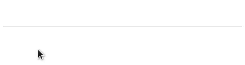

# material-ui-chip-input
This project provides a [chip input field][chipspec] for [Material-UI][mui]. It is inspired by [Angular Material's chip input][angular-chips].



If you want to try the component yourself instead of watching a gif, head over to [the storybook][gh-pages] for a live demo!

## Installation
```shell
npm i --save material-ui-chip-input
```

## Usage
The component supports either controlled or uncontrolled input mode. If you use the controlled mode (by setting the `value` attribute), the `onChange` callback won't be called.

```jsx
import ChipInput from 'material-ui-chip-input'

// uncontrolled input
<ChipInput
  defaultValue={['foo', 'bar']}
  onChange={(chips) => handleChange(chips)}
/>

// controlled input
<ChipInput
  value={yourChips}
  onRequestAdd={(chip) => handleAddChip(chip)}
  onRequestDelete={(chip) => handleDeleteChip(chip)}
/>
```

## Properties
| Name | Type | Default | Description |
| --- | --- | --- | --- |
| chipRenderer | 'function' | | A function of the type `({ value, isFocused, isDisabled, handleClick, handleRequestDelete }, key) => node` that returns a chip based on the given properties. This can be used to customize chip styles. |
| clearOnBlur | `bool` | `true` | Clears the input value after the component looses focus if set to true. |
| dataSource | `array` | | Data source for auto complete. |
| defaultValue | `string[]` | | The chips to display by default (for uncontrolled mode). |
| disabled | `bool` | `false` | Disables the chip input if set to true. |
| errorText | `node` | | The error text to display. |
| floatingLabelText | `node` | | The content of the floating label. |
| hintText | `node` | | The hint text to display. |
| onChange | `function` | | Callback function that is called when the chips change (in uncontrolled mode). |
| onRequestAdd | `function` | | Callback function that is called when a new chip was added (in controlled mode). |
| onRequestDelete | `function` | | Callback function that is called when a new chip was removed (in controlled mode). |
| onTouchTap | `function` | | Callback function that is called when text input is clicked. |
| onUpdateInput | `function` | | Callback function that is called when the input changes (useful for auto complete). |
| openOnFocus | `bool` | `false` | Opens the auto complete list on focus if set to true. |
| style | `object` | | Override the inline-styles of the root element. |
| value | `string[]` | | The chips to display (enables controlled mode if set). |


Additionally, most other properties of Material UI's [Auto Complete][mui-auto-complete] and [Text Field][mui-text-field] should be supported. Please open an issue if something is missing or does not work as expected.

## Credits
The code for the input component was adapted from Material UI's [Auto Complete][mui-auto-complete] and [Text Field][mui-text-field] that we all know and love.

## License
The files included in this repository are licensed under the MIT license.

[chipspec]: https://material.google.com/components/chips.html#chips-behavior
[mui]: http://www.material-ui.com/#/
[angular-chips]: https://material.angularjs.org/latest/demo/chips
[mui-text-field]: http://www.material-ui.com/#/components/text-field
[mui-auto-complete]: http://www.material-ui.com/#/components/auto-complete
[gh-pages]: https://teamwertarbyte.github.io/material-ui-chip-input/
